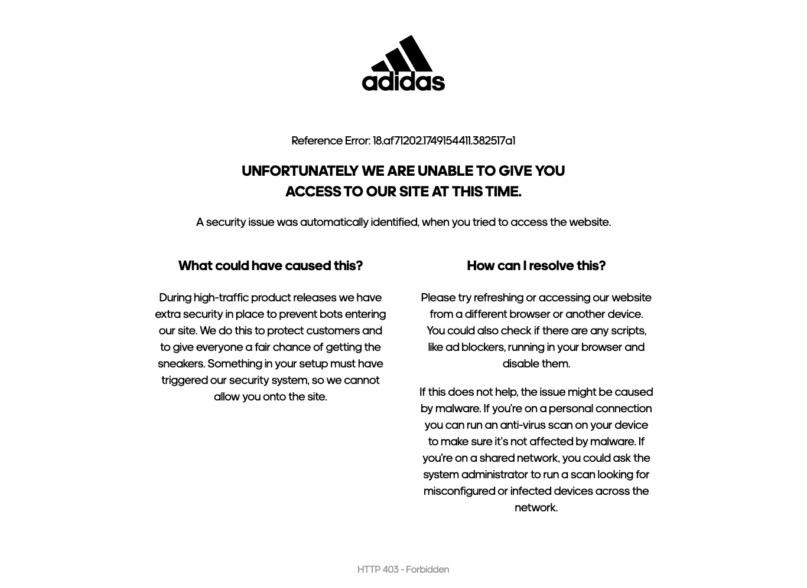

# Shoes Marketplace Backend

## Business Goal
This project is a backend service designed to scrape and compare shoe prices from multiple e-commerce stores across different countries. It aims to facilitate price comparison and analysis of purchasing power by collecting data from various retailers including Adidas and Grid.

Part of a larger initiative to compare product prices across Argentina, Chile, Brazil, and the USA, helping users understand price differences and dollar value variations between countries.

## Known Issues

### Adidas Scraper Blocked

Currently, the scraper for `adidas.com.ar` is being blocked by their bot detection system. Despite using `puppeteer-extra` with the stealth plugin and disabling JavaScript, the site returns a 403 Forbidden page (see `adidas_debug_01_afterGoTo.png` in the project root for an example of the block page).

**Screenshot of Block Page:**



*(Ensure `adidas_debug_01_afterGoTo.png` is present in the project root for this image to display)*

**Likely Cause:**
The block is likely due to advanced bot detection measures, such as IP reputation scoring, TLS fingerprinting, or sophisticated HTTP header analysis, which are difficult to bypass without more advanced techniques.

**Recommended Solution:**
To resolve this, the most effective approach is to integrate a **rotating proxy service**, preferably one that offers residential or mobile IP addresses. This will make the scraper's requests appear as organic traffic from various legitimate sources, significantly reducing the chances of being detected and blocked.

When implementing a proxy, you would typically configure Puppeteer's launch arguments (e.g., `--proxy-server=YOUR_PROXY_IP:YOUR_PROXY_PORT`) and handle proxy authentication if needed (`page.authenticate()`).

## Tech Stack
- **Framework**: NestJS
- **Language**: TypeScript
- **Database**: MongoDB
- **Web Scraping**: Puppeteer
- **Runtime**: Node.js v20.x

## Features
- Scrapes product data from Adidas Argentina
- Scrapes product data from Grid Argentina
- Stores product information in MongoDB
- Provides API endpoints to retrieve product data
- CORS protection with configurable allowed origins

## Project Structure

```
shoes-marketplace-be/
├── src/                        # Source code
│   ├── products/               # Products module
│   │   ├── dto/                # Data Transfer Objects
│   │   ├── schemas/            # Database schemas
│   │   ├── products.controller.ts  # API endpoints
│   │   ├── products.service.ts     # Business logic
│   │   └── products.module.ts      # Module configuration
│   ├── app.module.ts           # Main application module
│   └── main.ts                 # Application entry point
├── .gitignore                  # Git ignore rules
├── .nvmrc                      # Node version specification
├── Procfile                    # For deployment (Heroku)
├── package.json                # Dependencies and scripts
├── package-lock.json           # Locked dependencies
└── tsconfig.json               # TypeScript configuration
```

## API Endpoints

- `GET /products/test` - Simple test endpoint to verify the application is running
- `GET /products/scrape/adidas` - Trigger Adidas website scraping
- `GET /products/scrape/grid` - Trigger Grid website scraping
- `GET /products` - Retrieve all products from database

## Prerequisites

- Node.js v20.x
- MongoDB installation or connection string
- Chrome/Chromium (for Puppeteer)

## Environment Variables

The following environment variables need to be set:

- `MONGODB_URI` - MongoDB connection string (required)
- `PORT` - Application port (defaults to 3000)
- `CORS_URLS` - Comma-separated list of allowed origins for CORS
- `CHROME_BIN` - Optional path to Chrome executable for Puppeteer (useful for deployment)

## Installation

```bash
# Install dependencies
npm install

# Install Puppeteer browsers
npm run puppeteer-install
```

## Running the Application

### Development
```bash
# Build the application
npm run build

# Start the server
npm start
```

### Production
```bash
# Build for production
npm run build

# Start in production mode
npm run start:prod
```

## Deployment
The application includes a Procfile for Heroku deployment. The project is configured to run on Node.js v20.x environment.

## Data Model

Products collected include:
- Name
- Price
- Image URL
- Product link
- Store name (adidas, grid)

## Notes for Development
- The scraping logic uses Puppeteer with headless Chrome
- For Adidas scraping, JavaScript is disabled to improve scraping reliability
- Custom user-agent is used to prevent blocking by websites
- Products are uniquely identified by their link URL
- Prices are formatted and cleaned before storing in the database
